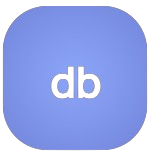

  

<h1 align="center">dbtalk</h1>

Ask your database anything, in plain English.

---

## Overview

**dbtalk** is a natural-language-to-SQL application. You type a question about your IoT sensor data and an LLM agent translates it into a read-only SQL query, runs it against a TimescaleDB, and returns a natural-language answer along with the SQL it used and the raw result rows.

## Features

- Agent is grounded in the live database schema and few-shot SQL examples so it queries real columns instead of inventing them
- Generated queries are sanitized to allow only `SELECT`/`WITH`; any DML/DDL is rejected before execution
- When a query errors, the agent reads the error message and revises the SQL, retrying up to 5 attempts
- UI shows the natural-language answer, a syntax-highlighted SQL block, and the raw result rows
- Each chat session carries its own ID with in-memory checkpointing
- Deterministic generator produces realistic temperature readings and random outage windows for local development and testing
- Evaluation harness scores the agent against expected answers and records per-call latency and token metrics